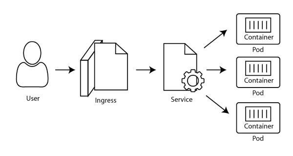

# Lab 03 - Creating a Service
## Estimated time to complete: 20 minutes

Now that we've got a deployment running, let's route traffic into it.

Here's a network diagram of how we typically build out the components in Kubernetes:



1. Users connect through DNS to an Ingress.
2. Ingress maps a host name to a service.
3. A service is a load-balancer in front of all the matching pods.
4. Traffic flows to the container in the pod.

When working locally, we'll skip the Ingress step because Ingress doesn't work well with Docker Desktop and Minikube.  We'll use Ingress when we get to cloud-hosted Kubernetes.


Step 0: Ensure Kubernetes is running
------------------------------------

1. Run `kubectl cluster-info` and `kubectl version`.

Step 0: Build the Image
-----------------------

1. For this exercise, we're going to be using the `hellonode:0.1` image built in the previous course (Lab 03).  If you don't have it, you can use `rdiazconcha/hellonode:0.1` as the container image.

Step 1: Craft a service.yaml file
-----------------------------

**Note:** Yaml files are white-space significant.  Indenting is done with **2 spaces**, not 4 spaces, not tabs.

1. Create a new file named `service.yaml`.

2. Write these lines:

   ```
   apiVersion: v1
   kind: Service
   ```

   This says we're using a `Service` object, and it's found in Kubernetes's `v1` namespace.

3. Next, we'll define the `metadata` section:

   ```
   metadata:
     name: hellonode-service
   ```

   We'll name this service `hellonode-service`, matching our theme of `hellonode-deployment` and `hellonode` pods.

4. The 4th section is the `spec` section:

   ```
   spec:
   ```

5. Here's some details about the service:

   ```
     type: NodePort
   ```

   A `NodePort` service creates an inbound port on each node in the cluster.  Kubernetes randomly picks a port in the 30,000 range.  Because Docker-desktop automatically proxies traffic from the host machine into the cluster, we'll be able to hit this `NodePort` from our browser.  In production, these ports would be exposed to the internet if the firewall around our Kubernetes cluster allowed it.

6. Add these lines:

   ```
     selector:
       app: hellonode
   ```

   Here we define which pods will get traffic from this service.  The service will locate all pods within the cluster that have `metadata` that includes `app: hellonode`.  The pods may have other metadata, but without this metadata, they won't receive traffic.

   In effect, this metadata match is the glue that connects services and pods.

7. Add these lines, indented to match the `selector` section:

   ```
     ports:
     - port: 3000
       targetPort: 3000
   ```

   This tells us that the port Kubernetes assigns to this `NodePort` will get routed to the service's port (`3000`, though we'll not use it this way), which will in turn get routed to the matching pods' port `3000`.

8. With that, we're done with the service.  Save the service.yaml file.


Step 2: Schedule the service
----------------------------

1. From the command prompt, type:

   ```
   kubectl apply -f service.yaml
   ```

   This says "please run the thing I've got in the yaml file `service.yaml`.

2. Run this command:

   ```
   kubectl get services
   ```

   Do you see the service?

3. Run this command:

   ```
   kubectl describe service hellonode-service
   ```

   This command tells us a lot about the service including the `NodePort` that Kubernetes randomly picked.

4. Open a browser to `http://localhost:NODE_PORT/`, replacing `NODE_PORT` with the `NodePort` you found in step 3.  When I ran step 3, I got port `30012` so I'll browse to `http://localhost:30012`.


What happened
-------------

This is how our browser got the results:

1. Browser looks to localhost:30012.

2. Docker-desktop forwards 30012 to the MobyLinuxVM.

3. Kubernetes forwards 30012 to `hellonode-service`'s port 3000.

4. The service looks for pods matching `app: hellonode`, and randomly picks a pod.

5. The service forwards the traffic to the chosen pod's port 3000.

6. The pod forwards traffic to the container's port 3000.

7. Node is listening in the container on port 3000.  It got the message, and returns the html.

8. The packet walks back out the same chain.

9. Our browser renders the page.

Dizzy?  Me too.  :D


Get the logs
------------

Let's get the console logs from Kubernetes.

1. From the command prompt:

   ```
   kubectl get all
   ```

   Locate the two pods

2. Run this command

   ```
   kubectl logs pod/hellonode-deployment-...
   ```

   substituting `...` for the first pod name above.

3. Run the same command for the other pod.

The interesting thing is Kubernetes's default service controller has sticky sessions, so probably all our traffic only went to one pod.


Deleting
--------

We had a blast creating the `hellonode` service, deployment, and pod.  Let's remove them all and get ready to deploy the bigger site.


1. Open a command prompt and navigate to the directory with `service.yaml`

2. Run:

   ```
   kubectl delete -f service.yaml
   ```

3. If necessary change directory to where you've saved `deployment.yaml`.

4. Run this:

   ```
   kubectl delete -f deployment.yaml
   ```

5. Verify everything is deleted

   ```
   kubectl get all
   ```

   If you hurry, you may see the pods getting terminated.  If so, re-run the command until everything is gone.

6. You should see the `kubernetes` service, but that's all.  See anything else?  Delete those as well.

You could also delete each thing by name, e.g. `kubectl delete hellonode-service`.

**Note:** Do **not** delete the `service/kubernetes` service.  This is the API we're sending `kubectl` commands to.  If this service is gone, the cluster is broken.